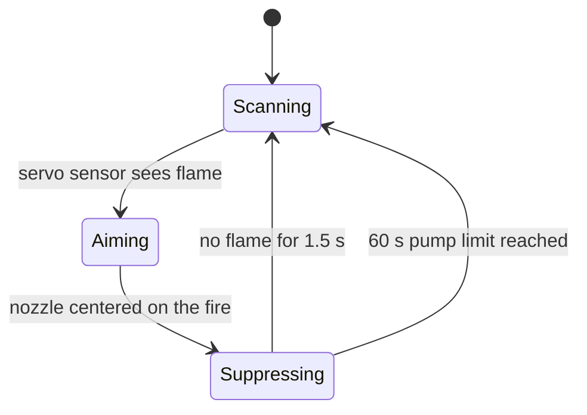
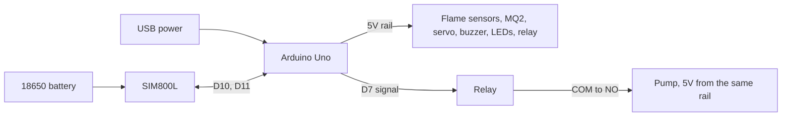

# Fire-detection-and-suppression-with-Offline-alert-system
Autonomous Arduino fire detection and suppression system. A servo-mounted flame sensor finds the fire, aims a water nozzle at it, and the pump runs only while flame is visible. Includes SMS and phone alerts and a live web dashboard.


An Arduino Uno project that watches for fire, aims a water nozzle at it, puts it out and alerts you. A live web dashboard shows everything in real time over the USB cable.

## Contents

1. [Features](#features)
2. [How it works](#how-it-works)
3. [Hardware list](#hardware-list)
4. [Power plan](#power-plan)
5. [Pin map](#pin-map)
6. [Detailed wiring, part by part](#detailed-wiring-part-by-part)
7. [Master wire list](#master-wire-list)
8. [Build order and testing](#build-order-and-testing)
9. [Upload the firmware](#upload-the-firmware)
10. [Run the dashboard](#run-the-dashboard)
11. [Settings you can tune](#settings-you-can-tune)
12. [Troubleshooting](#troubleshooting)
13. [Project structure](#project-structure)
14. [Safety note](#safety-note)
15. [License](#license)

## Features

- **Scanning nozzle:** a servo sweeps continuously with a flame sensor mounted on top of it.
- **Precise aiming:** when the servo sensor sees flame, the servo stops and centers the nozzle on the fire.
- **Water only when needed:** the pump (through a relay) runs only while flame is visible and stops 1.5 seconds after it is gone.
- **Early warning:** a second, fixed flame sensor sounds the buzzer as soon as it sees fire.
- **Smoke monitoring:** an MQ smoke sensor raises a warning LED. Smoke alone never starts the pump, because smoke lingers after the fire is out.
- **SMS alert:** a SIM800L module texts your phone once when the fire is locked (at most once a minute).
- **Safety limits:** flame confirmation filter (about 60 ms), 60 second maximum pump run, then a 10 second pause.
- **Live dashboard:** radar-style nozzle dial, sensor status, smoke chart, event log, full-screen fire warning with alarm sound, automatic phone push alert, CSV download, and a demo mode.

## How it works



1. **Scan:** the servo sweeps between 20 and 160 degrees.
2. **Detect:** flame must be seen for about 60 ms to count, which filters out flicker.
3. **Aim:** the servo turns slowly through the flame zone and stops in the middle of it.
4. **Spray:** the relay powers the pump while flame is visible.
5. **Return:** once the flame is gone for 1.5 seconds, the pump and buzzer stop and scanning resumes.

The fixed flame sensor sounds the buzzer early. The pump only runs when the servo sensor sees the flame, because that sensor points where the nozzle points.

## Hardware list

| Part | Qty | Notes |
|---|---|---|
| Arduino Uno | 1 | Powered from USB |
| Servo motor | 1 | 4.8 to 6 V, for example SG90 or MG90 type |
| KY-026 flame sensor | 2 | One fixed, one mounted on the servo |
| MQ smoke sensor (MQ2) | 1 | Needs a few minutes to warm up |
| 1-channel relay module | 1 | Usually active-LOW |
| Submersible pump | 1 | 3 to 5 V, 100 to 200 mA |
| Active buzzer | 1 | Makes sound when powered, no tone code needed |
| SIM800L GSM module | 1 | Needs SIM with balance, 2G coverage, antenna |
| 18650 battery and holder | 1 | Powers only the SIM800L |
| LEDs | 2 | Standby and alert |
| Resistors 220 to 330 ohm | 2 | One per LED |
| Resistors 10 kohm and 20 kohm | 1 each | Voltage divider for SIM800L RXD |
| Capacitor 1000 to 2200 uF | 1 | Optional, for SIM800L stability |
| Breadboard and jumper wires | 1 set | |

## Power plan



- **Arduino 5V rail (from USB):** flame sensors, MQ smoke sensor, servo, buzzer, LEDs, relay control side, and the pump (switched by the relay).
- **18650 battery:** the SIM800L only. Never give the SIM800L 5V.
- **Shared ground:** the battery and the Arduino share **GND only**. Never join the two + wires.
- Use a good USB wall adapter or power bank (1A or more). A weak one causes servo twitching and resets.

### Breadboard rails
Use the top rail pair: red line is **+ rail (5V)**, blue line is **- rail (GND)**. On many full-size breadboards each rail is split in the middle. If the left and right halves of a rail don't both have power, add a short jumper between the two halves for both + and -.

## Pin map

| Arduino pin | Connected to | Direction |
|---|---|---|
| 5V | Breadboard + rail | Power out |
| GND | Breadboard - rail | Ground |
| D2 | Fixed flame sensor, DO pin | Input |
| D3 | Servo-mounted flame sensor, DO pin | Input |
| A0 | MQ smoke sensor, AO pin | Analog input |
| D7 | Relay, IN pin | Output |
| D8 | Buzzer, + leg | Output |
| D9 | Servo, signal wire | Output (PWM) |
| D10 | SIM800L, TXD pin | Input (serial RX) |
| D11 | SIM800L, RXD pin, through a voltage divider | Output (serial TX) |
| D12 | Standby LED, through a resistor | Output |
| D13 | Alert LED, through a resistor | Output |

## Detailed wiring, part by part

Pin names and order vary between module makers. Always follow the labels printed on your own boards.

### 1. Power rails
| From | To |
|---|---|
| Arduino **5V** pin | Breadboard **+ rail** (red line) |
| Arduino **GND** pin | Breadboard **- rail** (blue line) |

### 2. Fixed flame sensor (KY-026)
The module has four pins, usually labeled **AO, GND, VCC (or +), DO**.

| Sensor pin | Connect to |
|---|---|
| VCC (+) | + rail |
| GND | - rail |
| DO | Arduino **D2** |
| AO | Not used |

### 3. Servo-mounted flame sensor (KY-026)
Fix this sensor on top of the servo so it points the same way as the water pipe. Use flexible wires so the servo can swing freely.

| Sensor pin | Connect to |
|---|---|
| VCC (+) | + rail |
| GND | - rail |
| DO | Arduino **D3** |
| AO | Not used |

**Sensitivity:** each module has a small blue screw (potentiometer). Turn it slowly while watching the module's small LED, which lights when it sees flame. Set it so the LED is off in normal light but turns on from as far away as possible.

### 4. MQ smoke sensor (MQ2)
Pins are usually **VCC, GND, DO, AO**.

| Sensor pin | Connect to |
|---|---|
| VCC | + rail |
| GND | - rail |
| AO | Arduino **A0** |
| DO | Not used |

### 5. Servo motor
| Servo wire | Connect to |
|---|---|
| Red | + rail (5V) |
| Brown or black | - rail (GND) |
| Orange or yellow (signal) | Arduino **D9** |

Mount the pump pipe on the servo horn so it moves together with the servo flame sensor.

### 6. Active buzzer
| Buzzer leg | Connect to |
|---|---|
| + (long leg, marked +) | Arduino **D8** |
| - (short leg) | - rail |

### 7. Relay module and pump
The relay board has two sides.

**Control side (three pins, connects to the Arduino):**

| Relay pin | Connect to |
|---|---|
| VCC | + rail |
| GND | - rail |
| IN | Arduino **D7** |

**Switch side (three screw terminals, carries the pump power):**

| Relay terminal | Connect to |
|---|---|
| **COM** (common) | + rail (5V) |
| **NO** (normally open) | Pump **red** wire |
| **NC** (normally closed) | Leave empty |

| Pump wire | Connect to |
|---|---|
| Red (+) | Relay **NO** terminal |
| Black (-) | - rail |

How it works: COM is the incoming 5V. When the relay is off, COM is not connected to NO, so the pump is off. When the Arduino switches the relay on, COM connects to NO and the pump gets power.

**Relay type:** most blue relay boards switch on when IN goes LOW (active-LOW). The code is set for this with `RELAY_ACTIVE_LOW = true`. If your pump runs when it should be off, change it to `false`.

**Tip:** tighten the screw terminals with a small screwdriver, and if possible use screw terminals instead of breadboard jumpers for the pump wires.

### 8. SIM800L GSM module (on its own 18650 battery)

**Power (battery, not the Arduino):**

| From | To |
|---|---|
| 18650 holder red (+) | SIM800L **VCC** |
| 18650 holder black (-) | SIM800L **GND** |
| SIM800L **GND** | Also to the breadboard **- rail** (shared ground) |

**Serial signals:**

| SIM800L pin | Connect to |
|---|---|
| TXD | Arduino **D10** (direct) |
| RXD | Arduino **D11**, **through the voltage divider below** |

**Voltage divider for RXD** (Arduino sends 5V, the SIM800L only tolerates about 3.3V):

```
Arduino D11 ---[ 10 kohm ]---+---[ 20 kohm ]--- GND (- rail)
                             |
                             +---> SIM800L RXD
```

1. Put a 10 kohm resistor between D11 and a free breadboard row (the junction).
2. Put a 20 kohm resistor between that same row and the - rail.
3. Run a wire from that same row to the SIM800L RXD pin.

**Optional capacitor:** put a 1000 to 2200 uF capacitor across VCC and GND, right next to the module. The long leg goes to VCC and the short leg (marked with a stripe) goes to GND. Add it if the module resets when sending an SMS.

**Also needed:**
- A SIM card with balance and no PIN lock, in the SIM slot.
- The antenna attached to the small round antenna socket.
- The pins soldered on if your module came without them.
- 2G coverage in your area (the SIM800L does not work on 3G or 4G only).

### 9. Status LEDs (optional)
The long leg of an LED is + and the short leg is -.

| LED | Connection path |
|---|---|
| Standby LED (on while all is calm) | Arduino **D12** to resistor (220 to 330 ohm) to LED long leg, LED short leg to - rail |
| Alert LED (on during fire, or when smoke is high) | Arduino **D13** to resistor (220 to 330 ohm) to LED long leg, LED short leg to - rail |

## Master wire list

Tick each wire off as you connect it.

| # | From | To |
|---|---|---|
| 1 | Arduino 5V | + rail |
| 2 | Arduino GND | - rail |
| 3 | Fixed flame sensor VCC | + rail |
| 4 | Fixed flame sensor GND | - rail |
| 5 | Fixed flame sensor DO | Arduino D2 |
| 6 | Servo flame sensor VCC | + rail |
| 7 | Servo flame sensor GND | - rail |
| 8 | Servo flame sensor DO | Arduino D3 |
| 9 | MQ2 VCC | + rail |
| 10 | MQ2 GND | - rail |
| 11 | MQ2 AO | Arduino A0 |
| 12 | Servo red | + rail |
| 13 | Servo brown or black | - rail |
| 14 | Servo signal | Arduino D9 |
| 15 | Buzzer + | Arduino D8 |
| 16 | Buzzer - | - rail |
| 17 | Relay VCC | + rail |
| 18 | Relay GND | - rail |
| 19 | Relay IN | Arduino D7 |
| 20 | Relay COM | + rail |
| 21 | Relay NO | Pump red |
| 22 | Pump black | - rail |
| 23 | 18650 red (+) | SIM800L VCC |
| 24 | 18650 black (-) | SIM800L GND |
| 25 | SIM800L GND | - rail |
| 26 | SIM800L TXD | Arduino D10 |
| 27 | Arduino D11 | 10 kohm resistor, then junction |
| 28 | Junction | 20 kohm resistor to - rail |
| 29 | Junction | SIM800L RXD |
| 30 | Arduino D12 | Resistor, standby LED long leg |
| 31 | Standby LED short leg | - rail |
| 32 | Arduino D13 | Resistor, alert LED long leg |
| 33 | Alert LED short leg | - rail |

## Build order and testing

Build in small steps and test each one, so a problem is easy to find.

1. **Power only:** connect wires 1 and 2, plug in USB. The Arduino's power LED should light.
2. **Upload the code** (see below) and open the Serial Monitor at 9600 baud. You should see `System ready. Scanning for fire...` followed by a status line every second.
3. **Servo:** connect wires 12 to 14. The servo should start sweeping.
4. **Flame sensors:** connect wires 3 to 8. Hold a small flame (lighter) a safe distance from a sensor. `ServoFlame` or `FixedFlame` should change to 1 in the Serial Monitor.
5. **Smoke sensor:** connect wires 9 to 11. Watch the `Smoke` value in clean air, then near a blown-out match. Set `SMOKE_THRESHOLD` above the clean-air value.
6. **Buzzer and LEDs:** connect wires 15, 16 and 30 to 33. The buzzer should beep only when flame is detected.
7. **Relay and pump:** connect wires 17 to 22. Test with the pump in a cup of water. The pump must be off when idle. If it is on, change `RELAY_ACTIVE_LOW`.
8. **SIM800L:** connect wires 23 to 29 last. Set your phone number in the code and check that an SMS arrives.
9. **Full test:** hold a small flame in front of the servo sensor and watch the servo stop, the buzzer beep, the pump start, and everything stop after the flame is removed.

## Upload the firmware

1. Install the [Arduino IDE](https://www.arduino.cc/en/software).
2. Open `firmware/fire_suppression_system/fire_suppression_system.ino`.
3. Set your phone number in `ALERT_PHONE_NUMBER` (international format, for example `+8801XXXXXXXXX`).
4. Check the two hardware settings near the top of the file:
   - `RELAY_ACTIVE_LOW`: `true` for most blue relay boards.
   - `FLAME_ACTIVE_STATE`: `LOW` for typical KY-026 modules.
5. Select **Arduino Uno** and your port, then click **Upload**.
6. Open the Serial Monitor at **9600 baud**.

The Arduino prints status lines like this once a second, and immediately when something changes:

```
State:FIGHTING | ServoFlame:1 FixedFlame:0 | Smoke:412 (HIGH) | Angle:92 | Pump:ON
```

## Run the dashboard

1. Open `dashboard/index.html` in **Chrome or Edge on a computer**.
2. Click **Try demo** to see a simulated fire without any hardware.
3. For real data: close the Arduino Serial Monitor (only one program can use the port), plug in the Arduino, click **Connect Arduino**, and choose its port.
4. For phone alerts: install the free ntfy app, subscribe to a topic name of your choice, and type the same name into the Phone alerts box. Press **Send test alert** to check it. After that, a real fire sends the alert automatically.

The dashboard needs the page open, the Arduino connected, and internet for the phone alert. The SMS from the SIM800L still works without the laptop.

## Settings you can tune

| Setting | What it does |
|---|---|
| `RELAY_ACTIVE_LOW` | Relay type. Flip it if the pump behaves backwards |
| `FLAME_ACTIVE_STATE` | Flame sensor output level when it sees fire |
| `SMOKE_THRESHOLD` | Smoke level that turns on the warning LED |
| `SCAN_MIN_ANGLE`, `SCAN_MAX_ANGLE` | Sweep range of the servo |
| `SCAN_STEP_MS` | Sweep speed (lower is faster) |
| `FIRE_OUT_MS` | How long flame must be gone before the pump stops |
| `MAX_PUMP_RUN_MS` | Longest pump run in one go |
| `SMS_MIN_INTERVAL_MS` | Minimum time between SMS messages |

## Troubleshooting

| Problem | Fix |
|---|---|
| Pump always on, or never on | Flip `RELAY_ACTIVE_LOW` |
| Sensors always or never show fire | Flip `FLAME_ACTIVE_STATE` between `LOW` and `HIGH` |
| Flame range too short | Turn the blue screw on the flame module. Avoid sunlight and bulbs |
| Servo twitches or Arduino resets | Use a stronger USB adapter or power bank |
| SMS not sending | Check SIM balance, PIN lock off, 2G coverage, battery power, voltage divider, shared GND, antenna |
| SIM800L resets when sending | Add the 1000 to 2200 uF capacitor across its VCC and GND |
| Dashboard cannot connect | Use Chrome or Edge, close the Serial Monitor, baud 9600 |
| Phone alert does not arrive | Topic name must match exactly, laptop needs internet, allow ntfy notifications |

More detail is in [docs/troubleshooting.md](docs/troubleshooting.md).

## Project structure

```
firmware/fire_suppression_system/   Arduino sketch
dashboard/index.html                Live dashboard (single file, no install)
docs/wiring.md                      Wiring and power guide
docs/troubleshooting.md             Fixes for common problems
```

## Safety note

This is a student prototype. It is not a certified fire safety device and must not replace smoke alarms, fire extinguishers, or professional systems. Test with a small, controlled flame in a safe area, and keep water away from the electronics.

## Privacy

Do not commit your real phone number to a public repository. Keep the placeholder in the code you publish. The ntfy topic name is stored only in your browser, never in the files.

## Author.

Istiaq Ahmed Srabon, CSE, Southeast University.

## License

MIT. See [LICENSE](LICENSE).
